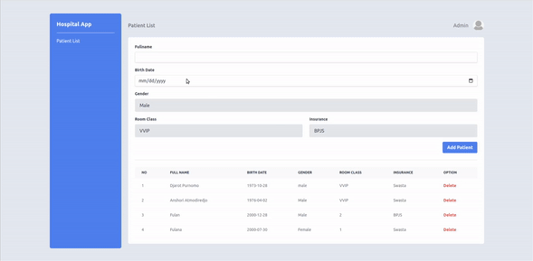

# Bootcamp Front-End by Skill Academy Camp

# Hospital App - Admin Page

## Final Projechtml-final-project-hospital-app-v1t

### NOTES

- Pada skeleton kode yang terdapat file `main.test.js` tidak boleh diubah sama sekali.
- Dilarang mengganti nama function yang diberikan.
- Wajib menjalankan `npm install` atau `pnpm install` sebelum mengerjakan project.

### Objectives

- Dapat menggunakan DOM untuk membuat _website_.
- Dapat melakukan call API.

### Description

Pada Final Project kali ini kalian diminta untuk melanjutkan pembuatan website di assignment sebelumnya. Dimana tugas kalian adalah menambahkan DOM ke dalam website yang sudah kalian buat (**Silahkan copy paste code yang kalian buat pada assignment sebelumya ke dalam file `index.html`**). dengan ketentuan berikut ini:

1. Disediakan sebuah `json-server` dalam file `./server/hospital-db.json`. Server dapat di jalankan menggunakan command `npm run start:server`.

   > pastikan kalian sudah melakukan instalasi [json-server](https://www.npmjs.com/package/json-server) sebelumnya

2. Terdapat beberapa _endpoint_, antara lain:

   ```txt
   GET /patient
   POST /patient
   DELETE /patient/id
   ```

   > server akan berjalan pada `http://localhost:3001`

3. Ketika halaman web di render pertama kali, data pasien pada _database_ secara otomatis di tampilkan.

4. _Form_ digunakan untuk melakukan penambahan data pasien. Ketika button "Add Patient" di klik maka _form_ akan melakukan _submit_ data kedalam _database_ dan data terbaru akan langsung di tampilkan secara _realtime_ tanpa perlu melakukan _refresh_ halaman.

5. Ketika tombol "Delete" di klik maka akan menghapus data pasien dalam _database_ dan data pasien yang di _delete_ secara otomatis di hilangkan. Perlu di perhatikan, jika sebelumnya _delete button_ pada bagian `Option` berupa tag html `button` dengan `type` `button` dan `id` berupa `delete-btn`, maka kalian perlu **mengganti** `id` menjadi `class` dengan nilai yang sama berupa `delete-btn`.

   ```html
   <button class="delete-btn" type="button">Delete</button>
   ```

6. Disediakan beberapa _function_ pada file `main.js` dengan penamaan sesuai fungsinya.
   - `getPatient` : _Function_ ini digunakan untuk mendapatkan seluruh data pasien pada _database_, lalu menempelkan data tersebut menggunakan DOM dan menampilkannya pada browser.
   - `addPatient` : _Function_ ini digunakan untuk melakukan menambahan data pasien pada _database_.
   - `deletePatient` : _Function_ ini menerima parameter `id` dari setiap pasien dan digunakan untuk data pada _database_ sesuai id yang diterima

### Workspace

Pengerjaan dilakukan pada file `index.html` & `main.js`

Berikut contoh halaman _web_ dari _hospital-app_ yang perlu kalian buat (**tidak perlu mengikuti _design_/_styling_ pada contoh**):


